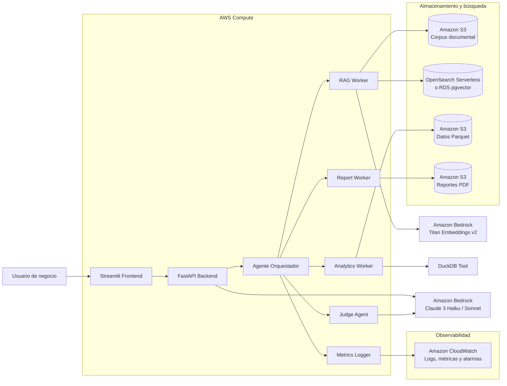

# Documento de Arquitectura

## Sistema Agéntico Analítico con LLM + RAG + Tools

**Proyecto:** Sistema Agéntico Analítico con LLM + RAG + Tools
**Rol aplicado:** Python Developer / Data Analyst con IA
**Nube asignada:** Amazon Web Services
**Lenguaje principal:** Python 3.12+
**Interfaz:** Streamlit
**Backend:** FastAPI
**Dominio:** Motor analítico conversacional para indicadores financieros y de desempeño

---

## 1. Descripción general

Este documento describe la arquitectura del sistema agéntico desarrollado para consultar indicadores financieros y de desempeño mediante lenguaje natural.

El sistema integra un agente orquestador, recuperación aumentada por documentos, herramientas analíticas externas, generación de reportes, evaluación mediante agente juez y observabilidad de KPIs. El objetivo es demostrar una solución funcional, modular, documentada y desplegable que combine capacidades de IA generativa, análisis de datos y arquitectura cloud sobre Amazon Web Services.

El dominio elegido corresponde a un motor analítico conversacional para indicadores de desempeño, con énfasis en siniestralidad, análisis regional, KPIs, reportes ejecutivos y métricas de observabilidad.

---

## 2. Objetivos de arquitectura

La arquitectura se diseñó con los siguientes objetivos:

1. Permitir consultas en lenguaje natural sobre indicadores de negocio.
2. Recuperar contexto documental relevante mediante un pipeline RAG.
3. Ejecutar análisis estructurado con DuckDB sobre datos Parquet.
4. Calcular KPIs derivados, como brechas, promedios y variaciones.
5. Generar reportes PDF cuando el usuario lo solicite.
6. Validar la respuesta mediante un agente juez.
7. Registrar métricas de observabilidad para monitorear calidad, costo, latencia y precisión.
8. Preparar el sistema para una migración natural hacia AWS usando Amazon Bedrock, S3, OpenSearch o pgvector, ECS/Fargate y CloudWatch.

---

## 3. Vista general de arquitectura

### 3.1 Flujo funcional del MVP

```text
Usuario
  ↓
Interfaz Streamlit
  ↓
Backend FastAPI
  ↓
Agente Orquestador
  ├── Worker RAG
  │     └── Vector store local persistente + reranking híbrido
  │
  ├── Worker Analítico
  │     └── DuckDB Tool sobre Parquet
  │
  ├── KPI Calculator
  │     └── Cálculo de brechas y variaciones
  │
  ├── PDF Generator
  │     └── Generación de reporte ejecutivo
  │
  └── Judge Agent
        └── Evaluación de calidad de respuesta
  ↓
Métricas de observabilidad
  ↓
Respuesta final al usuario
```

---

### 3.2 Diagrama C4 / AWS propuesto

El siguiente diagrama representa la arquitectura objetivo del sistema en AWS, manteniendo la misma separación lógica implementada en el MVP local.



### Lectura del diagrama

El usuario interactúa con la interfaz Streamlit. La consulta es enviada al backend FastAPI, que invoca el agente orquestador. El orquestador coordina los sub-workers especializados: recuperación RAG, análisis estructurado, generación de reportes, agente juez y registro de métricas.

En la versión AWS, el corpus documental y los archivos Parquet se almacenan en Amazon S3. La recuperación semántica se apoya en Amazon Titan Embeddings v2 y en un vector store productivo como Amazon OpenSearch Serverless o pgvector en Amazon RDS. El modelo LLM y el agente juez se ejecutan mediante Amazon Bedrock. Las métricas y logs se envían a Amazon CloudWatch.

---

## 4. Componentes principales

### 4.1 Interfaz de usuario: Streamlit

La interfaz permite al usuario realizar consultas, ejecutar el flujo agéntico y visualizar:

* Respuesta generada.
* Fuentes recuperadas por RAG.
* Tools ejecutadas.
* Evaluación del agente juez.
* Reporte PDF descargable.
* Dashboard ejecutivo con los 8 KPIs de observabilidad.

Archivo principal:

```text
app/ui_streamlit.py
```

---

### 4.2 Backend: FastAPI

FastAPI expone el endpoint principal del sistema:

```text
POST /chat
```

Este endpoint recibe una pregunta del usuario y retorna una respuesta estructurada con:

* Respuesta textual.
* Fuentes RAG.
* Tools ejecutadas.
* Resultado del agente juez.
* Métricas de observabilidad.

Archivo principal:

```text
app/main.py
```

---

### 4.3 Agente orquestador

El agente orquestador es el núcleo del sistema. Su función es coordinar el flujo completo de ejecución.

Responsabilidades:

* Recibir la pregunta del usuario.
* Ejecutar recuperación documental.
* Decidir si la consulta requiere análisis estructurado.
* Ejecutar DuckDB sobre Parquet.
* Calcular KPIs si hay datos numéricos.
* Generar PDF si el usuario lo solicita.
* Componer la respuesta con fallback local o LLM.
* Invocar el agente juez.
* Registrar métricas de observabilidad.

Archivo principal:

```text
orchestrator/agent_orchestrator.py
```

---

## 5. Patrón Orchestrator & Sub-Workers

El sistema implementa el patrón **Orchestrator & Sub-Workers**.

### 5.1 Orquestador principal

El orquestador recibe la consulta general y delega subtareas a módulos especializados.

### 5.2 Sub-worker RAG

Encargado de recuperar información documental relevante.

Archivo:

```text
workers/rag_worker.py
```

### 5.3 Sub-worker analítico

Encargado de ejecutar consultas estructuradas sobre datos Parquet mediante DuckDB.

Archivo:

```text
workers/analytics_worker.py
```

### 5.4 Sub-worker de reportes

Encargado de generar reportes PDF.

Archivo:

```text
workers/report_worker.py
```

### 5.5 Agente juez

Evalúa la calidad de la respuesta final antes de entregarla.

Archivo:

```text
judge/judge_llm.py
```

---

## 6. Pipeline RAG

### 6.1 Corpus documental

El corpus se encuentra en:

```text
data/documents/
```

Contiene documentos relacionados con:

* Política de indicadores.
* Metodología de KPIs.
* Interpretación de siniestralidad.
* Lineamientos de reportes ejecutivos.

Ejemplo de documentos:

```text
01_politica_indicadores.txt
02_metodologia_kpis.txt
03_guia_interpretacion_siniestralidad.txt
04_lineamientos_reporte_ejecutivo.txt
```

---

### 6.2 Estrategia de ingesta

El sistema lee documentos en formato `.txt` y `.pdf`.

Para archivos PDF se utiliza:

```text
pypdf
```

Para archivos TXT se usa lectura directa con codificación UTF-8.

La ingesta local se ejecuta automáticamente al consultar el sistema. El componente RAG revisa los documentos disponibles, calcula una huella documental y determina si el índice local debe reconstruirse.

---

### 6.3 Estrategia de chunking

El texto se divide en fragmentos de tamaño controlado:

```text
chunk_size = 900 caracteres
chunk_overlap = 150 caracteres
```

La superposición permite conservar continuidad semántica entre fragmentos consecutivos.

Esta estrategia es adecuada para documentos analíticos y ejecutivos porque mantiene suficiente contexto en cada fragmento sin generar chunks excesivamente grandes.

---

### 6.4 Vector store local persistente

En el MVP local se implementa un **vector store local persistente** usando Python, scikit-learn y almacenamiento en disco mediante `pickle`.

Archivo principal:

```text
rag/vector_store.py
```

Archivo adaptador usado por el worker RAG:

```text
rag/local_retriever.py
```

El índice se almacena en:

```text
data/vector_store/local_vector_index.pkl
```

La ruta es configurable mediante:

```env
VECTOR_STORE_PATH=./data/vector_store
```

El flujo local es:

```text
Documentos TXT/PDF
→ Extracción de texto
→ Limpieza básica
→ Chunking con overlap
→ Vectorización local con TF-IDF
→ Almacenamiento persistente del índice
→ Recuperación por similitud coseno
→ Reranking híbrido
→ Normalización de scores
→ Retorno de chunks al orquestador
```

Aunque el MVP local usa TF-IDF como técnica de vectorización, la arquitectura está diseñada para migrar este componente a embeddings productivos en AWS mediante Amazon Titan Embeddings v2 y almacenamiento vectorial en OpenSearch Serverless o pgvector.

---

### 6.5 Fingerprint documental e invalidación del índice

Para evitar recalcular el índice en cada consulta, el vector store local calcula una huella documental basada en:

* Nombre de los documentos.
* Contenido binario de los documentos.
* Tamaño de chunk.
* Overlap.
* Número máximo de features.

Si la huella documental cambia, el índice se reconstruye automáticamente.

Esto permite:

* Reutilizar el índice entre consultas.
* Mejorar latencia.
* Mantener consistencia cuando se agregan o modifican documentos.
* Hacer más defendible el pipeline de ingesta y almacenamiento.

---

### 6.6 Recuperación local en el MVP

La recuperación local se basa en:

```text
TF-IDF + cosine similarity
```

Por cada consulta:

1. Se transforma la pregunta del usuario con el mismo vectorizador del índice.
2. Se calcula similitud coseno contra los chunks indexados.
3. Se seleccionan candidatos iniciales.
4. Se aplica reranking híbrido.
5. Se retornan los chunks más relevantes.

La salida del RAG incluye campos como:

```json
{
  "index_mode": "local_persistent_vector_store",
  "chunks_indexed": 4,
  "reranking_strategy": "hybrid_vector_keyword_reranking"
}
```

Cada chunk recuperado incluye:

```json
{
  "source": "03_guia_interpretacion_siniestralidad.txt",
  "chunk_id": "03_guia_interpretacion_siniestralidad_1",
  "raw_score": 0.2841,
  "vector_score": 1.0,
  "keyword_score": 0.6,
  "rerank_score": 0.9,
  "score": 1.0
}
```

---

### 6.7 Reranking híbrido

El sistema implementa un reranking híbrido que combina:

```text
75% similitud vectorial normalizada
25% coincidencia léxica con términos de la pregunta
```

Fórmula conceptual:

```text
rerank_score = 0.75 * vector_score + 0.25 * keyword_score
```

Luego se normaliza el score final de los chunks seleccionados:

```text
score = rerank_score / max_rerank_score
```

Esta estrategia permite priorizar chunks que sean relevantes tanto por similitud vectorial como por coincidencia explícita de términos importantes.

En una versión productiva, este reranking puede evolucionar a:

* Cross-encoder especializado.
* Reranking con LLM.
* Reranking con Amazon Bedrock.
* Reranking con Cohere Rerank, si se habilita como servicio externo.

---

### 6.8 Augmentación del prompt

El orquestador utiliza los chunks recuperados por el RAG para construir el contexto que acompaña la pregunta del usuario y los resultados analíticos.

La respuesta final se compone a partir de:

* Pregunta original.
* Fragmentos documentales recuperados.
* Fuentes consultadas.
* Resultados DuckDB, si aplica.
* Cálculos KPI, si aplica.
* Evaluación del agente juez.

---

### 6.9 Versión RAG productiva en AWS

Para producción se propone:

```text
Amazon S3
→ Amazon Titan Embeddings v2
→ Amazon OpenSearch Serverless o pgvector en RDS
→ Retriever semántico
→ Reranking
→ Prompt aumentado
→ Amazon Bedrock
```

El MVP local mantiene la misma separación conceptual para facilitar la migración hacia servicios administrados de AWS.

---

## 7. Tools implementadas

El sistema implementa herramientas externas invocadas por el orquestador.

---

### 7.1 Tool 1: DuckDB Analytics

Herramienta de consulta analítica sobre Parquet.

Archivo:

```text
tools/duckdb_tool.py
```

Entrada:

```json
{
  "question": "Compara el promedio del indicador de siniestralidad por regional"
}
```

Salida:

```json
{
  "success": true,
  "sql": "SELECT regional, COUNT(*), AVG(valor_indicador) ...",
  "data": [
    {
      "regional": "Bogotá",
      "total_registros": 3,
      "promedio_indicador": 72.63
    }
  ]
}
```

Uso principal:

* Promedios.
* Agrupaciones por regional.
* Agrupaciones por mes.
* Mínimos y máximos.
* Conteos.

---

### 7.2 Tool 2: KPI Calculator

Herramienta para calcular KPIs derivados.

Archivo:

```text
tools/kpi_calculator.py
```

Funciones principales:

* Cálculo de brecha absoluta.
* Cálculo de variación porcentual.
* Interpretación básica de variación.

Entrada:

```json
{
  "value_a": 72.63,
  "value_b": 68.27,
  "label_a": "Bogotá",
  "label_b": "Antioquia"
}
```

Salida:

```json
{
  "success": true,
  "absolute_gap": 4.36,
  "higher_value": "Bogotá"
}
```

---

### 7.3 Tool 3: PDF Generator

Herramienta para generar reportes PDF.

Archivo:

```text
tools/pdf_generator.py
```

Entrada:

```json
{
  "title": "Reporte analítico generado por el sistema agéntico",
  "content": "Respuesta generada por el sistema..."
}
```

Salida:

```json
{
  "success": true,
  "file_path": "./data/reports/reporte_YYYYMMDD_HHMMSS.pdf"
}
```

---

### 7.4 Contrato general de tools

Cada tool retorna una estructura compatible con el esquema `ToolCall`:

```json
{
  "tool_name": "duckdb_analytics",
  "input": {},
  "output": {},
  "success": true
}
```

Esto permite que el orquestador registre trazabilidad de ejecución y calcule la tasa de éxito de herramientas.

---

## 8. Agente juez

El agente juez evalúa la respuesta generada por el orquestador.

### 8.1 Criterios de evaluación

El juez revisa:

1. Relevancia frente a la pregunta.
2. Uso correcto del contexto RAG.
3. Precisión numérica.
4. Riesgo de alucinación.
5. Claridad para usuario de negocio.

---

### 8.2 Modo local

Cuando:

```env
USE_BEDROCK=false
```

el juez utiliza una evaluación heurística local.

Evalúa:

* Si existen chunks RAG.
* Si hubo error analítico.
* Si la respuesta tiene contenido suficiente.
* Si los datos numéricos parecen provenir de la consulta analítica.

---

### 8.3 Modo Bedrock

Cuando:

```env
USE_BEDROCK=true
```

el sistema puede invocar un Judge LLM en Amazon Bedrock.

El prompt del juez solicita una salida JSON con:

```json
{
  "score": 8.0,
  "verdict": "aprobada con observaciones",
  "numeric_precision": "Sin errores numéricos detectados",
  "hallucination_risk": "bajo",
  "improvement_suggestion": "Mejorar explicación ejecutiva"
}
```

---

## 9. Selección del LLM

### 9.1 Modelos comparados

Se comparan dos modelos disponibles en Amazon Bedrock:

| Modelo          | Ventajas                                                                    | Consideraciones                                         |
| --------------- | --------------------------------------------------------------------------- | ------------------------------------------------------- |
| Claude 3 Haiku  | Baja latencia, bajo costo, buena capacidad para instrucciones estructuradas | Menor capacidad de razonamiento que modelos más grandes |
| Claude 3 Sonnet | Mayor razonamiento, mejor síntesis, mejor desempeño en tareas complejas     | Mayor costo y latencia                                  |

---

### 9.2 Modelo principal seleccionado

Se propone **Claude 3 Haiku** como modelo principal.

Justificación:

* Adecuado para respuestas analíticas estructuradas.
* Buena relación costo-beneficio.
* Baja latencia.
* Útil para consultas frecuentes.
* Capacidad suficiente para interpretar contexto RAG y resultados tabulares simples.

---

### 9.3 Modelo fallback

Se propone **Claude 3 Sonnet** como fallback para:

* Consultas más complejas.
* Mayor razonamiento cuantitativo.
* Evaluaciones avanzadas del agente juez.
* Casos en los que Haiku genere una respuesta insuficiente.

---

### 9.4 Parámetros recomendados

```text
temperature = 0.2
top_p = 0.9
max_tokens = 900
```

Justificación:

* Temperatura baja para reducir variabilidad.
* `top_p` controlado para mantener diversidad moderada.
* `max_tokens` suficiente para respuestas ejecutivas sin elevar demasiado el costo.

---

### 9.5 Estrategia de fallback y control de costos

La estrategia propuesta es:

1. Usar Claude 3 Haiku por defecto.
2. Usar Claude 3 Sonnet solo en consultas complejas o de baja calificación del juez.
3. Mantener prompts compactos.
4. Limitar cantidad de chunks RAG.
5. Registrar tokens estimados por sesión.
6. Calcular costo estimado por consulta.
7. Alertar si el costo supera el umbral definido.

---

## 10. Privacidad y seguridad

La arquitectura propone mantener los datos dentro del entorno AWS.

Medidas previstas:

* Corpus documental en Amazon S3 privado.
* Cifrado en reposo para S3, RDS y OpenSearch.
* Uso de IAM Roles con privilegios mínimos.
* Variables sensibles en AWS Secrets Manager.
* Logs controlados en CloudWatch.
* Evitar envío de datos a servicios externos fuera de AWS.
* Uso de Amazon Bedrock como servicio administrado dentro del ecosistema AWS.

---

## 11. Observabilidad

El sistema registra métricas en:

```text
data/metrics.jsonl
```

La interfaz Streamlit muestra un dashboard con los 8 KPIs mínimos.

---

### 11.1 KPIs implementados

| # | KPI                         | Métrica                  | Umbral               |
| - | --------------------------- | ------------------------ | -------------------- |
| 1 | Tasa de éxito de tools      | `tool_success_rate`      | >= 95%               |
| 2 | Score del agente juez       | `judge_score`            | >= 7.5 / 10          |
| 3 | Time to Last Token          | `ttl_seconds`            | < 10 segundos        |
| 4 | Costo estimado por consulta | `estimated_cost_usd`     | < USD 0.05           |
| 5 | Tasa de error en cálculos   | `calculation_error_rate` | < 3%                 |
| 6 | Latencia RAG                | `rag_latency_seconds`    | < 2 segundos         |
| 7 | Cobertura del corpus RAG    | `rag_corpus_coverage`    | >= 85%               |
| 8 | Tokens promedio por sesión  | `avg_tokens_per_session` | Reportar y optimizar |

---

### 11.2 Observabilidad en AWS

En AWS, las métricas pueden enviarse a CloudWatch mediante logs estructurados en JSON.

Propuesta:

```text
Aplicación FastAPI / Streamlit
→ Logs JSON
→ CloudWatch Logs
→ CloudWatch Metrics
→ CloudWatch Dashboard
→ Alarmas por umbral
```

Alarmas sugeridas:

* `tool_success_rate < 0.95`
* `judge_score < 7.5`
* `ttl_seconds > 10`
* `estimated_cost_usd > 0.05`
* `calculation_error_rate > 0.03`
* `rag_latency_seconds > 2`
* `rag_corpus_coverage < 0.85`

---

## 12. Diagrama de despliegue AWS propuesto

```text
Usuario
  ↓
Internet
  ↓
Application Load Balancer / API Gateway
  ↓
ECS Fargate o EC2 con Docker
  ├── FastAPI Backend
  ├── Streamlit Frontend
  └── Servicios internos de orquestación
        ↓
        Amazon Bedrock
        ↓
        Claude 3 Haiku / Claude 3 Sonnet

ECS / EC2
  ↓
Amazon S3
  ├── Corpus documental
  ├── Datos Parquet
  ├── Reportes PDF
  └── Logs exportados

ECS / EC2
  ↓
Amazon OpenSearch Serverless / RDS pgvector
  └── Vector Store RAG

ECS / EC2
  ↓
Amazon CloudWatch
  ├── Logs
  ├── Métricas
  ├── Dashboards
  └── Alarmas
```

---

## 13. Estimación de costos AWS

La siguiente es una estimación de referencia para un MVP de baja escala.

| Servicio                             |                           Uso estimado | Costo mensual aproximado |
| ------------------------------------ | -------------------------------------: | -----------------------: |
| Amazon Bedrock                       | Consultas moderadas con Claude 3 Haiku |               USD 5 - 30 |
| S3                                   |       Documentos, Parquet, PDFs y logs |                USD 1 - 5 |
| ECS Fargate o EC2                    |                   Servicio web pequeño |              USD 10 - 40 |
| CloudWatch                           |                Logs y métricas básicas |               USD 1 - 10 |
| OpenSearch Serverless / RDS pgvector |                Vector store productivo |              USD 20 - 80 |
| Total estimado MVP                   |                            Baja escala |             USD 37 - 165 |

Para reducir costos en una demo se puede usar:

* EC2 pequeña.
* Vector store local durante desarrollo.
* S3 como almacenamiento principal.
* Bedrock solo bajo demanda.
* Apagado de recursos cuando no estén en uso.

---

## 14. Contratos de entrada y salida

### 14.1 Endpoint `/chat`

Entrada:

```json
{
  "question": "Compara el promedio del indicador de siniestralidad por regional"
}
```

Salida:

```json
{
  "answer": "Respuesta generada por el sistema",
  "sources": ["01_politica_indicadores.txt"],
  "tool_calls": [],
  "judge": {
    "score": 8.0,
    "verdict": "Respuesta aprobada",
    "numeric_precision": "Sin errores detectados",
    "hallucination_risk": "Bajo",
    "improvement_suggestion": "N/A"
  },
  "metrics": {
    "tool_success_rate": 1.0,
    "judge_score": 8.0,
    "ttl_seconds": 0.12,
    "estimated_cost_usd": 0.00005,
    "calculation_error_rate": 0.0,
    "rag_latency_seconds": 0.03,
    "rag_corpus_coverage": 1.0,
    "avg_tokens_per_session": 230
  }
}
```

---

### 14.2 Salida esperada del componente RAG

```json
{
  "query": "Compara el promedio del indicador de siniestralidad por regional",
  "chunks": [
    {
      "text": "Fragmento documental recuperado...",
      "source": "02_metodologia_kpis.txt",
      "chunk_id": "02_metodologia_kpis_1",
      "raw_score": 0.2841,
      "vector_score": 1.0,
      "keyword_score": 0.6,
      "rerank_score": 0.9,
      "score": 1.0
    }
  ],
  "sources": ["02_metodologia_kpis.txt"],
  "latency_seconds": 0.0104,
  "index_mode": "local_persistent_vector_store",
  "chunks_indexed": 4,
  "reranking_strategy": "hybrid_vector_keyword_reranking"
}
```

---

## 15. Limitaciones del MVP

El MVP demuestra el flujo funcional completo, pero tiene limitaciones propias de una versión local:

* El RAG usa vectorización local con TF-IDF, no embeddings productivos de Bedrock en modo local.
* El vector store productivo aún no está en OpenSearch ni pgvector.
* El juez usa fallback heurístico cuando Bedrock está desactivado.
* El costo Bedrock es estimado.
* Los datos Parquet son datos de prueba.
* CloudWatch está documentado como arquitectura objetivo.
* No se implementa autenticación de usuarios.
* No se implementa control avanzado de permisos sobre documentos.
* El despliegue AWS está propuesto para ECS/Fargate o EC2, pero el MVP puede ejecutarse localmente.

---

## 16. Conclusión

La arquitectura implementada permite demostrar un sistema agéntico funcional con integración de RAG, tools analíticas, generación de reportes, juez evaluador y observabilidad. La solución está diseñada para ejecutarse localmente durante la demostración y para evolucionar hacia una arquitectura cloud en Amazon Web Services usando Bedrock, S3, OpenSearch o pgvector, ECS/Fargate y CloudWatch.

El diseño prioriza modularidad, trazabilidad, control de costos, claridad analítica, recuperación documental persistente y facilidad de despliegue.

